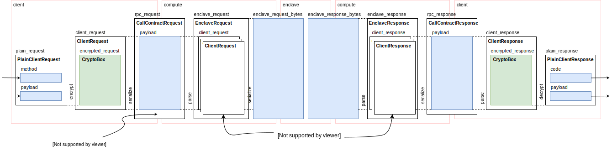

# RPC

## Defining an API

An API may be defined by using the `rpc_api` macro provided by `ekiden_core`. It is usually defined in its own API crate as it needs to be available for import both for enclaves and clients.

A simple API definition looks as follows:
```rust
rpc_api! {
    metadata {
        name = dummy;
        version = "0.1.0";
        client_attestation_required = false;
    }

    rpc hello_world(HelloWorldRequest) -> HelloWorldResponse;
}
```

There are a few different things in here:
* The `metadata` section defines some metadata, which name and version the API and expose some additional attributes.
* RPC method definitions, each starting with the keyword `rpc`.

An RPC method definition looks similar to a Rust function definition and is composed from the following parts:
* Method name (e.g., `hello_world`) which defines how the method will be called.
* Request type (e.g., `HelloWorldRequest`) which defines the Rust type containing the request message. This can be any type implementing Serde's `Deserialize` trait.
* Response type (e.g., `HelloWorldResponse`) which defines the Rust type containing the response message. This can be any type implementing Serde's `Serialize` trait.

This same API definition can be used to generate both enclaves and clients. This is achieved by making the `rpc_api` generate in its place another macro called `with_api` which can be used from both enclaves and clients.

## Creating an enclave RPC server

In order to create an enclave RPC server using the API we just defined, we need to import the API and instruct the RPC system to generate some glue code that will call our method implementations.
This can be done as follows:
```rust
use ekiden_trusted::rpc::create_enclave_rpc;
use dummy_api::{with_api, HelloWorldRequest, HelloWorldResponse};

with_api! {
    create_enclave_rpc!(api);
}
```

This creates the glue that is needed to connect the API definitions to our method implementations. Next, we need to define the methods themselves:
```rust
fn hello_world(request: &HelloWorldRequest) -> Result<HelloWorldResponse> {
    let mut response = HelloWorldResponse::new();
    response.set_answer(request.get_question() + 42);

    Ok(response)
}
```

## Creating a client

To create an RPC client for our API, we need to again import the API definitions and generate the required glue code:
```rust
use ekiden_rpc_client::create_client_rpc;
use dummy_api::{with_api, HelloWorldRequest, HelloWorldResponse};

with_api! {
    create_client_rpc!(dummy, dummy_api, api);
}
```

This will create the client and necessary types inside a module named `dummy` (first argument to `create_client_rpc` macro).
We can use this to create clients that talk to an Ekiden Compute node over gRPC:
```rust
use std::sync::Arc;

use ekiden_rpc_client::backend::Web3RpcClientBackend;
use grpcio;

// Create gRPC event loop.
let grpc_environment = Arc::new(grpcio::EnvBuilder::new().build());

let client = dummy::Client::new(
    Arc::new(Web3RpcClientBackend::new(
        grpc_environment,
        "hostname",
        9001,
    ).unwrap()),
    MrEnclave([0; 32]),  // This needs to be an actual MRENCLAVE.
);

let request = dummy::HelloWorldRequest::new();
request.set_question(0);

let response = client.hello_world(request).wait().unwrap();
assert_eq!(response.get_answer(), 42);
```

## Internals

### Secure channel protocol

All remote procedure calls are made over a secure channel which is automatically established on first request.
This section provides detailed information about how the secure channel establishment protocol works.

#### Keys
The following keys are maintained by the enclave identity for use in RPC:
* E - contract long-term public key pair.

The following keys appear in the protocol and are maintained externally:
* C - client long-term public key pair.
  The client maintains this key pair.
  When a contract acts as a client, the enclave identity maintains this key pair.

The following keys are maintained by the protocol:
* E' - contract short-term public key pair, generated by ekiden-rpc-trusted in the secure enclave for each client session.
* C' - client short-term public key pair, generated by the client before establishing a secure channel.

The following statements are used by the protocol:
* IPE - enclave identity proof, refreshed periodically from IAS, which binds the enclave identity to the long-term public key E.
* IPC - client identity proof, which binds the client enclave identity to the long-term public key C.

#### State
The secure channel can be in one of the following states:
* `Closed`
  Channel is closed (this is the initial state) and must be reset. After being reset, the channel with transition into `Init` state.
* `Init`
  Channel is being initialized. After successful contract authentication, the channel will transition into `ClientAuthenticating` or `Established` state.
* `ClientAuthenticating`
  (Client only) Client is authenticating. After successful client authentication, the channel will transition into `Established` state.
* `Established`
  Secure channel is established and may be used to make arbitrary method calls.

#### Notation
`Box[X](C->E)` is a cryptographic box, encrypting and authenticating `X` from the client's public key `C` to the contract's public key `E`. The only people who can create or decipher `Box[X](C->E)` are the people who know the secret key corresponding to `C` and the people who know the secret key corresponding to `E`.

#### Protocol
* Client sends `(C')`.
* Contract sends `(IPE, Box[E'](E->C'))`.
* If client authentication is required, Client sends `(C', Box[IPC, Box[C'](C->E)](C'->E'))`.
* From this point forward, for each request, the client transmits `(C', Box[request](C'->E')`, where `request` is a properly serialized request.
* From this point forward, for each response, the server transmits `(Box[response](E'->C'))` where `response` is a properly serialized response.
* The channel is now established.

#### Nonces
While not explicitly mentioned above, each cryptographic box also contains a 24-byte nonce. Each nonce contains a 16-byte "nonce context" prefix, which prevents the message from being used in a different context. The following 8-bytes are generated based on the kind of message.

Where long-term keys are involved (only the channel initialization messages), the nonces are generated using a cryptographically secure random generator.

Where short-term keys are involved (unique for each session), the nonces are generated using a monotonically increasing counter. Both the client and the contract verify that each following nonce is greater than the last. This prevents message replays.

#### Cryptography
The protocol uses NaCl primitives (e.g. the authenticated encryption is implemented using Curve25519, Salsa20, and Poly1305).

### RPC types

Making a call to a contract moves the method name, arguments, response code, return value, and state through several messages between the client, compute node, and contract enclave.
See the diagram below for a summary of these types.


